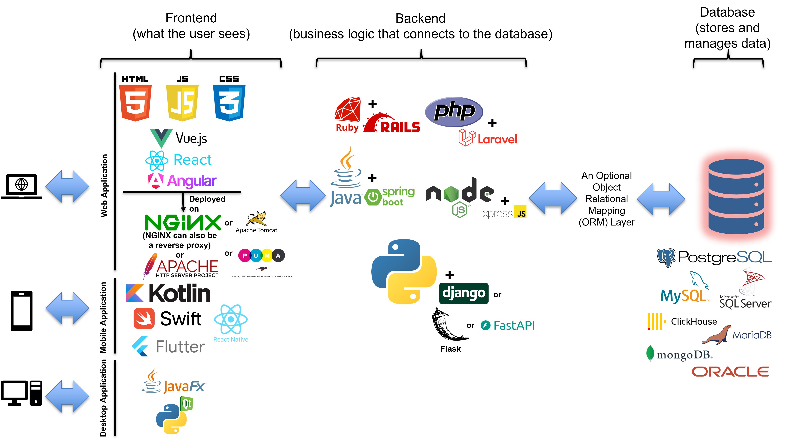
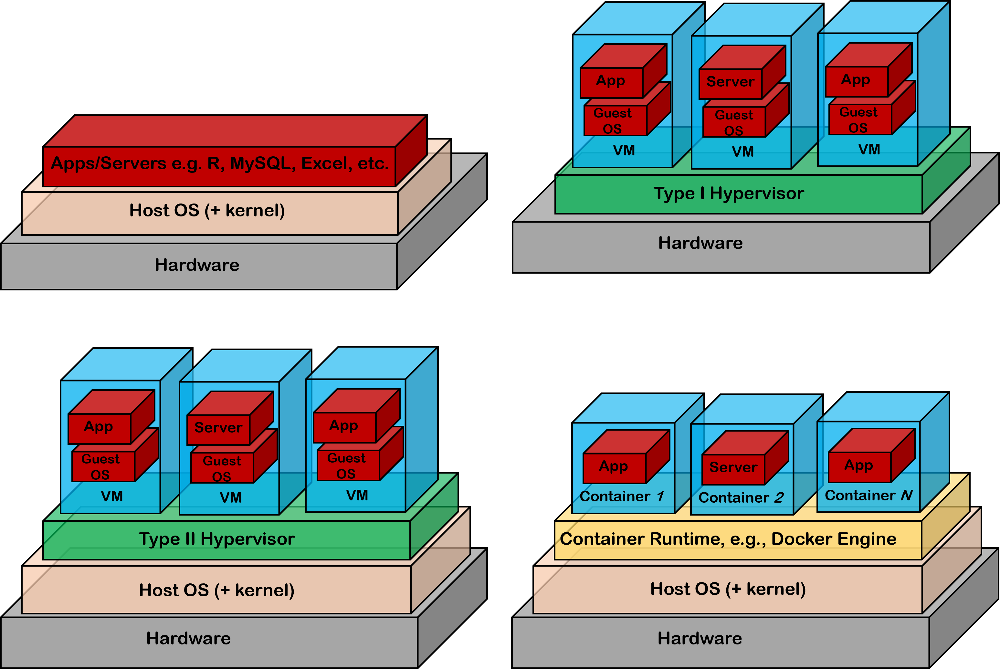
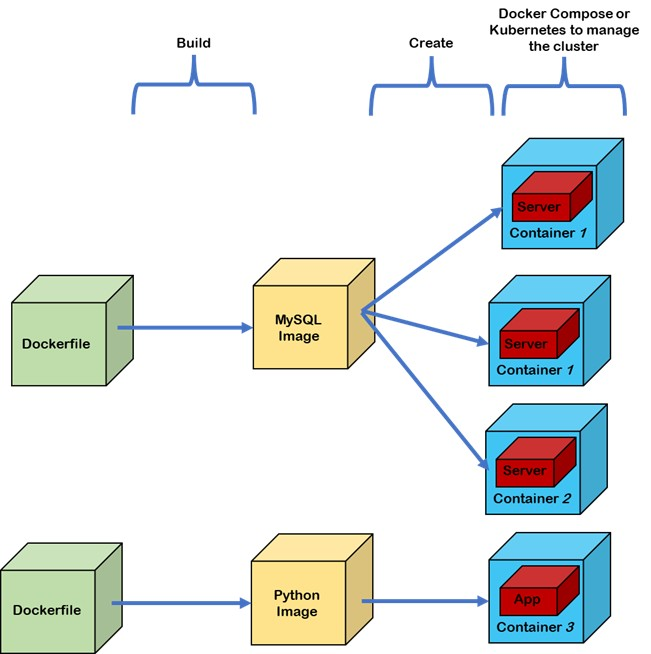

# Installing PostgreSQL


---

## Overview

PostgreSQL can be installed in various options. This lab takes you through 3 different options. Each option achieves the same end result — a running PostgreSQL database — but teaches you different skills along the way.

| Method | Description | Skills Gained |
| -------- | ------------- | --------------- |
| **A — Direct Install** | Install PostgreSQL directly on your laptop. This is useful when working as a developer using your personal laptop. | Basic installation, local database access |
| **B — Virtual Machine** | Install Ubuntu Server in VirtualBox, then install PostgreSQL inside it. | Linux server administration, networking, SSH |
| **C — Docker Container** | Run PostgreSQL inside a container. | Modern fast deployment, containerization concepts |

---

## Method A — Direct Installation on Your Laptop

This is the fastest way to get started. PostgreSQL runs directly on your operating system, however, this is not expected in a production environment. In production, databases run on dedicated servers or in containers, not on developers' personal laptops.

###  A.1 — Windows

**Step 1:** Download the PostgreSQL installer for Windows.

Navigate to: [https://www.postgresql.org/download/windows/](https://www.postgresql.org/download/windows/)

Click **"Download the installer"** (which leads you to [https://www.enterprisedb.com/downloads/postgres-postgresql-downloads](https://www.enterprisedb.com/downloads/postgres-postgresql-downloads) ).

Select the PostgreSQL 18.x release for **Windows x86-64**.

**Step 2:** Run the installer.

Double-click the downloaded `.exe` file. Grant administrator permissions when prompted.

- Accept the default installation directory.
- On the component selection screen, ensure the following are all checked:
  - **PostgreSQL Server**
  - **pgAdmin 4**
  - **Command Line Tools**
- Accept the default data directory.

**Step 3:** Set the superuser password.

When prompted, set a password for the `postgres` user. Choose something you will remember — if you lose it, you will need to reinstall.

> Do not use a blank password. Do not use the word `password`.

**Step 4:** Accept the default port `5432` and default locale. Complete the installation.

Uncheck **"Launch Stack Builder at exit"** — you do not need it for now.

**Step 5:** Verify the installation.

Open the **Start Menu**, search for **SQL Shell (psql)**, and launch it. Press Enter to accept all the default prompts until you are asked for a password. Enter the password you set in Step 3.

You should see:

```text
postgres=#
```

Run:

```sql
SELECT version();
\q
```

---

###  A.2 — macOS

#### Option 1 — Homebrew (Recommended)

Homebrew is a package manager for macOS. It is the standard tool used by developers to install software on macOS.

**Step 1:** Install Homebrew if you do not already have it. Open **Terminal** (Applications → Utilities → Terminal) and run:

```bash
/bin/bash -c "$(curl -fsSL https://raw.githubusercontent.com/Homebrew/install/HEAD/install.sh)"
```

**Step 2:** Install PostgreSQL:

```bash
brew install postgresql@18
```

**Step 3:** Start the service so it runs automatically on login:

```bash
brew services start postgresql@18
```

**Step 4:** Add PostgreSQL to your PATH so the `psql` command is available in your terminal:

```bash
echo 'export PATH="/opt/homebrew/opt/postgresql@18/bin:$PATH"' >> ~/.zshrc
source ~/.zshrc
```

> **Note for Intel Macs:** Replace `/opt/homebrew` with `/usr/local` in the command above.

**Step 5:** Verify:

```bash
psql --version
psql -U $(whoami) -d postgres
```

#### Option 2 — EDB Installer

If you prefer an easier graphical installer, you can download it from: [https://www.enterprisedb.com/downloads/postgres-postgresql-downloads](https://www.enterprisedb.com/downloads/postgres-postgresql-downloads)

Follow the same steps as the Windows installer in Section A.1.

---

###  A.3 — Linux (Ubuntu / Debian)

**Step 1:** Add the official PostgreSQL repository:

```bash
sudo apt install -y curl ca-certificates
sudo install -d /usr/share/postgresql-common/pgdg
sudo curl -o /usr/share/postgresql-common/pgdg/apt.postgresql.org.asc --fail \
    https://www.postgresql.org/media/keys/ACCC4CF8.asc
sudo sh -c 'echo "deb [signed-by=/usr/share/postgresql-common/pgdg/apt.postgresql.org.asc] \
    https://apt.postgresql.org/pub/repos/apt $(lsb_release -cs)-pgdg main" \
    > /etc/apt/sources.list.d/pgdg.list'
```

**Step 2:** Install PostgreSQL:

```bash
sudo apt update
sudo apt install -y postgresql postgresql-contrib
```

**Step 3:** Start and enable the service:

```bash
sudo systemctl start postgresql
sudo systemctl enable postgresql
```

**Step 4:** Verify:

```bash
psql --version
sudo systemctl status postgresql
```

**Step 5:** Connect using the default system account:

```bash
sudo -i -u postgres
psql
```

You should see the `postgres=#` prompt. Type `\q` to exit.

---

## Method B — PostgreSQL Inside a Linux Virtual Machine

This section teaches you how real-world database servers are deployed and administered. We will:

1. Create a Host-Only network in VirtualBox (so your laptop can always reach the VM)
2. Create a Virtual Machine (VM) with two network adapters
3. Install Ubuntu Server 26.04 LTS inside the VM
4. Install and configure PostgreSQL on the Ubuntu Server
5. SSH into the server from your laptop
6. Connect to PostgreSQL from pgAdmin running on your laptop

> **Why Ubuntu Server and not Ubuntu Desktop?** Production database servers do not have a graphical desktop. They are administered entirely through the command line. Being comfortable with the Linux command line interface early will serve you well in an IT infrastructure or System Administration role.

---

### B.1 — Download the Required Software

**Step 1:** Download the Ubuntu Server 26.04 LTS ISO.

Navigate to: [https://ubuntu.com/download/server](https://ubuntu.com/download/server)

Download the **Ubuntu Server 26.04 LTS** ISO file. It is approximately 3 GB.

**Step 2:** Download and install VirtualBox which is a Type II hypervisor

Navigate to: [https://www.virtualbox.org/wiki/Downloads](https://www.virtualbox.org/wiki/Downloads)

Download the installer for your operating system (**Windows hosts**, **macOS hosts**, or **Linux hosts**) and install it.

Also download the **VirtualBox Extension Pack** from the same page.

**Step 3:** Install the VirtualBox Extension Pack after installing VirtualBox.

Open VirtualBox. In the menu, go to **File → Tools → Extension Pack Manager** (on macOS: **VirtualBox → Preferences → Extensions**). Click the **Install** (➕) button, select the Extension Pack file you downloaded, and follow the prompts.

---

### B.2 — Create the Host-Only Network

A **Host-Only network** is a private network that exists only between your laptop (the host) and your virtual machines. It does not depend on the university's WiFi unlike a Bridged adapter, so it is more reliable for SSH and database connections. It also provides a layer of isolation — the VM is not directly exposed to the university network.

**Step 1:** In VirtualBox, open the Network Manager.

- **Windows / Linux:** Go to **File → Tools → Network Manager**
- **macOS:** Go to **VirtualBox → Tools → Network Manager**

**Step 2:** Click the **Host-only Networks** tab.

**Step 3:** Click the **Create** button (➕). VirtualBox will automatically create a network named:

- `vboxnet0` on macOS and Linux
- `VirtualBox Host-Only Ethernet Adapter` on Windows

**Step 4:** Select the newly created network and click the **Properties** icon.

Confirm the settings are as follows (these are the VirtualBox defaults):

| Setting | Value |
| --------- | ------- |
| IPv4 Address | `192.168.56.1` |
| IPv4 Network Mask | `255.255.255.0` |
| DHCP Server | Enabled |
| DHCP Server Address | `192.168.56.100` |
| Lower Address Bound | `192.168.56.101` |
| Upper Address Bound | `192.168.56.254` |

> This means your laptop's address on this private network is `192.168.56.1`. The VM will automatically receive an address between `192.168.56.101` and `192.168.56.254`. You will use that address later to SSH into the VM and to connect from pgAdmin.

Click **Apply** and close the Network Manager.

---

### B.3 — Create the Virtual Machine

**Step 1:** In VirtualBox, click **New** (or go to **Machine → New**).

**Step 2:** In the **Name and Operating System** section:

| Setting | Value |
| --------- | ------- |
| Name | `ubuntu-26-04-server` |
| VM Folder | (accept default) |
| ISO Image | Browse and select the Ubuntu Server 26.04 LTS ISO you downloaded |
| OS Type | Linux |
| OS Version | Ubuntu (64-bit) |

Ensure **"Proceed with Unattended Installation"** is **NOT** checked. You will perform the installation steps manually so that you learn how Ubuntu Server is set up.

**Step 3:** In the **Hardware** section:

| Setting | Value |
| --------- | ------- |
| Base Memory | `2048 MB` minimum; `4096 MB` if your laptop has 16 GB or more of RAM |
| Number of CPUs | `1` minimum; `2` if your laptop has sufficient resources |

**Step 4:** In the **Hard Disk** section:

| Setting | Value |
| --------- | ------- |
| Disk Size | `25 GB` |
| Pre-allocate Full Size | Leave unchecked so that it is dynamically allocated |

**Step 5:** Click **Finish**. Do **not** start the VM yet.

---

### B.4 — Configure the Two Network Adapters

| Adapter   | Type      | Purpose                                                                 |
|-----------|-----------|-------------------------------------------------------------------------|
| Adapter 1 | NAT       | Internet access — so the VM can download software                       |
| Adapter 2 | Host-Only | Private connection to your laptop — used for SSH and database access    |

With your VM selected in the left panel, click **Settings (Expert) → Network**.

**Adapter 1 tab:**

- Ensure **"Enable Network Adapter"** is checked.
- Set **"Attached to"** to **NAT**.
- Click on Port Forwarding and add a new rule:
  - Name: `SSH`
  - Protocol: `TCP`
  - Host IP: `127.0.0.1`
  - Host Port: `2222`
  - Guest IP: *leave it blank*
  - Guest Port: `22`

**Adapter 2 tab:**

- Check **"Enable Network Adapter"**.
- Set **"Attached to"** to **Host-only Adapter**.
- Set **"Name"** to the Host-Only network you created: `vboxnet0` (macOS/Linux) or `VirtualBox Host-Only Ethernet Adapter` (Windows).

Click **OK** to save.

---

### B.5 — Install Ubuntu Server

**Step 1:** Start the VM by double-clicking it or clicking **Start**.

The VM will boot from the Ubuntu Server ISO. You should see the Ubuntu installer screen. Select **"Try or install Ubuntu Server"** and press Enter.

**Step 2:** Work through the installer screens as follows.

**Language:** Select **English** and press Enter.

**Keyboard layout:** Select the default (**English (US)** for most Hosts) and press Enter.

**Choose type of installation:** Select **Install Ubuntu Server** and press Enter.

**Network connections:** You should see two network interfaces listed:

- `enp0s3` — your NAT adapter (should already have an IP starting with `10.0.2.x`)
- `enp0s8` — your Host-Only adapter (may show as "not connected" at this stage; but it may eventually get an IP in the `192.168.56.x` range from the DHCP server you set up in Section B.2)

**Proxy address:** Leave blank and press Enter.

**Ubuntu server mirror location:** It should successfully detect the mirror (the server where updates are downloaded from) based on your network. Press Enter to accept the default.

**Storage layout:** Select **"Use an entire disk"**. Accept the default disk. On the confirmation screen (Confirm destructive action), select **Continue**.

**Profile setup:** This is important. Enter the following:

| Field | Value |
| ------- | ------- |
| Your name | `student` |
| Your server's name | `classlab` |
| Username | `student` |
| Password | `student` |

> Do not use `student` as your password in a production environment.

**Upgrade to Ubuntu Pro?** Select **No**.

**Featured server snaps:** Do not select anything because you will perform most of the installations manually. Press **Done**.

**Step 3:** Wait for the installation to complete. This takes 10–15 minutes depending on your laptop's speed. When you see **"Installation complete!"**, select **"Reboot Now"**.

**Step 4:** After the reboot, you will be prompted to remove the installation medium. It is removed automatically. Press **Enter**. The VM will boot into the installed Ubuntu Server.

**Step 5:** Log in with the username `student` and the password you set.

---

### B.6 — Verify and Configure the Network Interfaces

After logging in, confirm that both network adapters are active.

**Step 1:** Check the network interfaces:

Next, find the IP address of your VM. This requires you to have `net-tools` installed first:

```bash
sudo apt install net-tools
```

Then execute:

```bash
ip addr show
```

You should see three interfaces:

```bash
1: lo         — the loopback interface (127.0.0.1) — always present
2: enp0s3     — NAT adapter — should have an address like 10.0.2.x
3: enp0s8     — Host-Only adapter — should have an address like 192.168.56.x
```

Note the IP address assigned to `enp0s8`. This is the address you will use for SSH and for pgAdmin. **Write it down.**

You can update the **port forwarding** rule you created in Section B.4 to use this IP address instead of leaving it blank.

- Go to Machine > Settings (Expert) > Network > Adapter 1 (Attached to NAT) > Port Forwarding and add a new rule:
  - Name: `SSH`
  - Protocol: `TCP`
  - Host IP: `127.0.0.1`
  - Host Port: `2222`
  - Guest IP: *leave it blank*
  - Guest Port: `22`

> If `enp0s8` does not have an IP address, proceed to Step 2. Otherwise, skip to Section B.7.

**Step 2 (only if `enp0s8` has no IP):** Configure the Host-Only adapter manually using netplan.

Open the netplan configuration file:

```bash
sudo nano /etc/netplan/50-cloud-init.yaml
```

The file will look similar to this (the exact contents may vary):

```yaml
network:
  version: 2
  ethernets:
    enp0s3:
      dhcp4: true
```

Edit it to add the second interface:

```yaml
network:
  version: 2
  ethernets:
    enp0s3:
      dhcp4: true
    enp0s8:
      dhcp4: true
```

> **How to use nano:** Use the arrow keys to move the cursor. Type to insert text. When you are done, press `Ctrl+O` to save (then press Enter to confirm the filename), and `Ctrl+X` to exit.

Apply the configuration:

```bash
sudo netplan apply
```

Check again:

```bash
ip addr show enp0s8
```

You should now see an IP address in the `192.168.56.x` range.

---

### B.7 — Install VirtualBox Guest Additions

Guest Additions improve the integration between the VM and your laptop. On a server (no graphical desktop), Guest Additions provide shared folders and improved performance.

```bash
sudo apt update
sudo apt install -y virtualbox-guest-utils
```

Reboot the VM to apply:

```bash
sudo reboot
```

Log back in after the reboot.

---

### B.8. Install and Configure OpenSSH Server in Ubuntu

**Step 1:** Execute the following commands to install the OpenSSH server:

```bash
sudo apt update
sudo apt install openssh-server
```

**Step 2:** Verify installation:

```bash
ssh -V
systemctl status ssh
```

**Step 3:** Start the SSH server

```bash
sudo systemctl start ssh
```

Set the SSH server to start automatically on boot

```bash
sudo systemctl enable ssh
```

**Step 4:** Add a firewall rule for SSH access

Allow SSH traffic to pass through the **UFW (Uncomplicated Firewall)** - the default for UFW is to **deny all**, then explicitly allow

Add the firewall rule to allow access through port 22 by executing:

```bash
sudo ufw allow ssh
```

Enable the firewall:

```bash
sudo ufw enable
```

Confirm that the firewall has been enabled:

```bash
sudo ufw status verbose
```

Confirm you can see `22/tcp ALLOW IN Anywhere` in the output.

**Step 5:** **Harden** SSH access

```bash
sudo vim /etc/ssh/sshd_config
```

Then add the following under the **Authentication** section:  
`PermitRootLogin no`

To edit content in `vim`, press `i` to enter insert mode, make your changes, then press `Esc` to exit insert mode, and type `:wq` to save and quit.

> **Why disable root login?** Any server exposed to the internet will receive thousands of automated login attempts targeting the `root` user. Disabling it means attackers cannot use the most privileged account even if they guess its password.

Then restart the SSH service to apply the changes:

```bash
sudo systemctl restart ssh
```

### B.9 — SSH into the VM from Your Laptop

Execute:

```bash
ip addr show
```

Note the IP address assigned to the `enp0s8` interface. `enp0s8` stands for Ethernet adapter located on PCI bus 0, slot 8.

Below is an example of the output you should see:

```text
student@classlab:~$ ip addr show
1: lo: <LOOPBACK,UP,LOWER_UP> mtu 65536 qdisc noqueue state UNKNOWN group default qlen 1000
    link/loopback 00:00:00:00:00:00 brd 00:00:00:00:00:00
    inet 127.0.0.1/8 scope host lo
       valid_lft forever preferred_lft forever
    inet6 ::1/128 scope host noprefixroute 
       valid_lft forever preferred_lft forever
2: enp0s3: <BROADCAST,MULTICAST,UP,LOWER_UP> mtu 1500 qdisc pfifo_fast state UP group default qlen 1000
    link/ether 08:00:27:8a:c1:6f brd ff:ff:ff:ff:ff:ff
    altname enx0800278ac16f
    inet 10.0.2.15/24 metric 100 brd 10.0.2.255 scope global dynamic enp0s3
       valid_lft 81403sec preferred_lft 81403sec
    inet6 fd17:625c:f037:2:a00:27ff:fe8a:c16f/64 scope global dynamic mngtmpaddr noprefixroute 
       valid_lft 86112sec preferred_lft 14112sec
    inet6 fe80::a00:27ff:fe8a:c16f/64 scope link proto kernel_ll 
       valid_lft forever preferred_lft forever
3: enp0s8: <BROADCAST,MULTICAST,UP,LOWER_UP> mtu 1500 qdisc pfifo_fast state UP group default qlen 1000
    link/ether 08:00:27:b8:27:f7 brd ff:ff:ff:ff:ff:ff
    altname enx080027b827f7
    inet 192.168.56.103/24 metric 100 brd 192.168.56.255 scope global dynamic enp0s8
       valid_lft 489sec preferred_lft 489sec
    inet6 fe80::a00:27ff:feb8:27f7/64 scope link proto kernel_ll 
       valid_lft forever preferred_lft forever
```

In this example, the IP address of the VM is `192.168.56.103`. **Replace this with the actual IP address of your VM when executing the following commands.**

Ping the VM from your host machine to confirm connectivity:

```bash
ping 192.168.56.103
```

This is the **Host-Only Adapter** which is used by the host to access the VM. Remember that we had also set port forwarding in Adapter 1 which was using NAT.

The port forwarding means that if we access `localhost` port `2222`, it is forwarded to the VM (`192.168.56.103`) via the VM's port `22`.

You will now leave the VM window and control the server entirely from your laptop's terminal or an application like PuTTY ([https://putty.org/index.html](https://putty.org/index.html)). This is how production servers are administered.

You can now SSH into your VM from your host machine using the host has `localhost` and the port as `2222`:

```bash
ssh -p 2222 student@localhost
```

This is executed from your host machine's terminal. Use the **Git Bash** terminal if you are on Windows and the default terminal if you are on Linux or macOS.

You will be prompted to enter the password for the `student` user, which you set during the Ubuntu Server installation.

You will see a message like:

```text
The authenticity of host 'localhost' cannot be established.
Are you sure you want to continue connecting (yes/no/[fingerprint])?
```

Type `yes` and press Enter. This is normal on the first connection — SSH is recording the server's identity so it can detect if it changes in future.

Enter your password when prompted.

You should now see:

```bash
student@classlab:~$
```

Alternatively, you can use the VM's Host-Only IP address directly from the host machine:

```bash
ssh -p 22 student@192.168.56.103
```

This bypasses the port forwarding and connects directly to the VM's SSH server on port 22. However, this can only be done from the host machine, not from another machine on the university network or business' network, because the Host-Only network is private between the host (your laptop) and the VM.

**You are now logged into your Ubuntu Server remotely.** From this point on, all commands in Sections B.10 onwards are typed in this SSH terminal, not in the VM window itself.

> You can now minimize the VirtualBox VM window. You do not need to interact with it directly again.

---

###  <br/>B.10 — Install PostgreSQL on Ubuntu Server

The following relies on the installation instructions provided by the vendor here: [https://www.postgresql.org/download/linux/ubuntu/](https://www.postgresql.org/download/linux/ubuntu/).

This is the standard procedure when installing services on a Linux server. You **should** rely on the vendor's documentation to ensure you are installing the software correctly and securely.

**Step 1:** Add the official PostgreSQL APT repository.

Using the official repository ensures you get the latest stable version of PostgreSQL rather than the version packaged with Ubuntu.

```bash
sudo apt install -y postgresql-common
sudo /usr/share/postgresql-common/pgdg/apt.postgresql.org.sh
```

**Step 2:** Install PostgreSQL:

```bash
sudo apt update
sudo apt install -y postgresql postgresql-contrib
```

**Step 3:** Start and enable the service:

```bash
sudo systemctl start postgresql
sudo systemctl enable postgresql
```

**Step 4:** Verify the installation:

```bash
psql --version
sudo systemctl status postgresql
```

You should see `Active: active (running)`.

**Step 5:** Set a password for the `postgres` superuser.

The `postgres` user is the default PostgreSQL superuser. By default, it has no password and can only be accessed from the server itself using peer authentication (i.e., you must be logged in as the Linux `postgres` system user).

```bash
sudo -u postgres psql
```

Inside the `psql` prompt:

```sql
ALTER USER postgres WITH ENCRYPTED PASSWORD 'your_password_here';
\q
```

Replace `your_password_here` with a strong password. Do not forget it.

> **`sudo -u postgres`** means: run the following command as the Linux user named `postgres`. This is a standard Linux technique for switching to a specific user. The `postgres` system user was created automatically when PostgreSQL was installed.

---

### B.11 — Open the Firewall for PostgreSQL

Add a firewall rule to allow database connections on port 5432:

```bash
sudo ufw allow 5432/tcp
sudo ufw status verbose
```

Confirm you see both port 22 (SSH) and port 5432 (PostgreSQL) listed as allowed:

```text
Status: active
Logging: on (low)
Default: deny (incoming), allow (outgoing), disabled (routed)
New profiles: skip

To                         Action      From
--                         ------      ----
22/tcp                     ALLOW IN    Anywhere                  
5432/tcp                   ALLOW IN    Anywhere                  
22/tcp (v6)                ALLOW IN    Anywhere (v6)             
5432/tcp (v6)              ALLOW IN    Anywhere (v6)
```

#### Production Environment Considerations

The rule above allows any machine to attempt a connection on port 5432. In a production environment, this is unacceptably permissive.

The expected practice is to restrict access to a specific, trusted IP address.

For example, suppose a web application — such as a restaurant ordering system built with Django or Node.js — is running on a separate server at IP address `192.168.56.10`. That application server is the only machine that legitimately needs to query the PostgreSQL database. You would replace the open rule with:

```bash
# Do not execute — for illustration only
sudo ufw allow from 192.168.56.10 to any port 5432 proto tcp
```

Meaning:

`allow` → permit the traffic  
`from 192.168.56.10` → only traffic originating from IP address 192.168.56.10  
`to any` → to any local network interface/address on this machine  
`port 5432` → targeting only port 5432  
`proto tcp` → only TCP traffic is allowed  

Therefore, this rule reads as: **"Allow TCP traffic arriving from 192.168.56.10, destined for any local network interface destined for port 5432 on this server, and deny everything else."**

Any other machine that attempts a connection on port 5432 — including an attacker who has gained access to the network — will be silently dropped by the firewall before it even reaches PostgreSQL.

The resulting ufw status output would look like this:

```text
To                         Action      From
--                         ------      ----
22/tcp                     ALLOW IN    Anywhere
5432/tcp                   ALLOW IN    192.168.56.10
```

**Why this matters:** A database server should never be a publicly reachable service. In a properly architected system, the database sits on a private network, the application server (backend) is the only machine allowed to query it, and the application server itself faces the Internet — accepting requests from users' browsers and translating them into database queries. This layered approach is called a three-tier architecture and is the foundation of almost every web-based Information System.

In production, a fourth component is typically placed in front of the application server: a reverse proxy such as `nginx` or `Caddy`. The reverse proxy is the only component directly exposed to the Internet — it handles TLS termination (HTTPS), rate limiting, and load balancing across multiple application server instances, then forwards clean traffic inward. The application server moves off the public network entirely. The result is a four-tier network topology still implementing a three-tier application architecture — a distinction that matters when you are designing infrastructure, not just writing code when developing an Information System.



Alternatively, if you want to enable a range of IP addresses, then you would use:

```bash
sudo ufw allow from 192.168.56.0/24 to any port 5432 proto tcp
```

`192.168.56.0/24` means "any address from `192.168.56.1` to `192.168.56.254`" — which is consistent with what `pg_hba.conf` already permits.

To delete a firewall rule:

```bash
sudo ufw status numbered
```

Then delete the rule by its number:

```bash
sudo ufw delete 3
```

Where `3` is the number of the rule you want to delete.

In this case, we will delete the open rule for port 5432 and replace it with a more restrictive rule in the next step.

Create a more restrictive rule that only allows access from the Host-Only subnet:

```bash
sudo ufw allow from 192.168.56.0/24 to any port 5432 proto tcp
```

Confirm the new rule is in place:

```bash
sudo ufw status verbose
```

You should now see:

```text
Status: active
Logging: on (low)
Default: deny (incoming), allow (outgoing), disabled (routed)
New profiles: skip

To                         Action      From
--                         ------      ----
22/tcp                     ALLOW IN    Anywhere                  
5432/tcp                   ALLOW IN    192.168.56.0/24           
22/tcp (v6)                ALLOW IN    Anywhere (v6) 
```

---

### B.12 — Configure PostgreSQL for Remote Access

By default, PostgreSQL only accepts connections from localhost (the server itself). You need to change two configuration files to allow your laptop to connect.

**Step 1:** Find the configuration files.

PostgreSQL stores its configuration in a directory named after its version. Use the * wildcard to avoid having to type the version number:

```bash
ls -al /etc/postgresql/*/main/
```

You will see files including `postgresql.conf` and `pg_hba.conf`.

**Step 2:** Edit `postgresql.conf` to make PostgreSQL listen on all network interfaces.

```bash
sudo vim /etc/postgresql/*/main/postgresql.conf
```

Use the vim search function to jump directly to the line rather than scrolling manually. In normal mode (i.e., before pressing i), type:

```text
/listen_addresses
```

Press `i` to enter insert mode. Remove the # and change the value:

`listen_addresses = '*'`

Press `Esc` to exit insert mode, then type `:wq` and press `Enter` to save and quit.

**Step 3:** Edit `pg_hba.conf` to allow password-authenticated connections from your laptop.

`pg_hba.conf` stands for PostgreSQL Host-Based Authentication. It is used to control which clients can connect, from which IP addresses, to which databases, using which authentication method.

Execute:

```bash
sudo vim /etc/postgresql/*/main/pg_hba.conf
```

Jump to the last line of the file immediately by typing `G` (capital `G`) in normal mode.

Press `o` (lowercase) to open a new line below the cursor and enter insert mode simultaneously. Add the following:

```text
host    all    all    192.168.56.0/24    scram-sha-256
```

This means: "Allow any user to connect to any database, from any IP address in the `192.168.56.0/24` subnet (i.e., your Host-Only network), using the scram-sha-256 password authentication method."

Press `Esc`, then type `:wq` and press Enter to save and quit.

> Why **192.168.56.0/24** and not **0.0.0.0/0** (all addresses)?  
> Restricting access to the Host-Only subnet means the database is only reachable from your laptop — not from the internet or other networks. This is a basic security principle: restrict access to what is actually needed. In production, you would restrict to specific trusted IP addresses.

**Step 4:** Restart PostgreSQL to apply the configuration changes:

```bash
sudo systemctl restart postgresql
```

**Step 5** — Verify that the service restarted cleanly without errors:

```bash
sudo systemctl status postgresql
```

You should see `Active: active (running)`. If you see `failed` or `inactive`, there is a syntax error in one of the two configuration files you edited. The error message will indicate which file and which line number. Fix the error and restart again.

**Step 6**: Verify that PostgreSQL is now listening on all interfaces:

```bash
sudo ss -tulnp | grep postgres
```

You should see an entry like this:

```text
tcp   LISTEN 0   200   0.0.0.0:5432   0.0.0.0:*   users:(("postgres",pid=...,fd=...))
tcp   LISTEN 0   200      [::]:5432      [::]:*   users:(("postgres",pid=...,fd=...))
```

The `0.0.0.0:5432` confirms that PostgreSQL is now accepting connections on all network interfaces, filtered by `pg_hba.conf` to the Host-Only subnet only.

`ss` is the modern replacement for `netstat` — it queries the kernel's **socket statistics** directly.

- `ss` Socket Statistics — lists all network sockets on the system
- `-t` Show TCP sockets only
- `-u` Show UDP sockets only (PostgreSQL does not use UDP; however, this is included for completeness)
- `-l` Show only listening sockets — i.e., services waiting for incoming connections
- `-n` Show numeric addresses and port numbers — do not resolve hostnames or service names
- `-p` Show the process that owns each socket
- `| grep postgres` Pipe the output through grep to filter and show only lines containing the word `postgres`, which is the name of the PostgreSQL process.

---

### B.13 — Test the Connection from Inside the VM

Before trying to connect from your laptop, confirm the connection works locally:

```bash
psql -U postgres -h localhost
```

Enter your password when prompted. You should see:

```text
postgres=#
```

Run a quick test:

```sql
SELECT version();
\l
\q
```

---

### B.14 — Connect to the VM's PostgreSQL from pgAdmin on Your Laptop

You will now connect from pgAdmin running on your laptop to the PostgreSQL instance running inside the VM.

**Install pgAdmin 4 on your laptop** (if not already installed):

- **Windows:** pgAdmin was installed by the EDB installer in Method A. If you skipped Method A: [https://www.pgadmin.org/download/pgadmin-4-windows/](https://www.pgadmin.org/download/pgadmin-4-windows/)
- **macOS:** [https://www.pgadmin.org/download/pgadmin-4-macos/](https://www.pgadmin.org/download/pgadmin-4-macos/)
- **Linux:** [https://www.pgadmin.org/download/pgadmin-4-apt/](https://www.pgadmin.org/download/pgadmin-4-apt/)

**Step 1:** Launch pgAdmin 4. On first launch, set a master password for pgAdmin itself (this is separate from the PostgreSQL password).

**Step 2:** In the left panel, right-click **Servers** → **Register** → **Server…**

**Step 3:** In the **General** tab:

- **Name:** `postgres@ubuntu-26-04-VM`

**Step 4:** In the **Connection** tab:

| Field | Value |
| ----- | ----- |
| Host name/address | `192.168.56.101` (replace with your VM's actual Host-Only IP). Execute `ip addr show` in the VM if you are unsure of the IP address. |
| Port | `5432` |
| Maintenance database | `postgres` |
| Username | `postgres` |
| Password | *(the password you set in Section B.10, Step 5)* |
| Save password | Check this box |

**Step 5:** Click **Save**.

If the connection is successful, you will see the server expand in the left panel with databases listed underneath.

**Step 6:** Create a sample database.

Right-click on **Databases** → **Create** → **Database…**

In the **Database** field, enter: `123456_sample_database` (replace `123456` with your student ID).

Click **Save**.

---

##  Method C — PostgreSQL in a Docker Container

Docker is a containerization platform that packages software together with everything it needs to run: the code, the runtime, libraries, and configuration files. A container starts in seconds, behaves identically on every machine, and is destroyed cleanly when no longer needed.

In production, many database services run in containers. In development, using a container allows you to avoid installing PostgreSQL directly on your laptop — which can be complex and may cause conflicts with other software. Instead, you run PostgreSQL in an isolated environment (the container) that is easy to set up and tear down.



---

### C.1 — Install Docker

#### Windows and macOS — Docker Desktop

Docker Desktop is the graphical application that installs and manages Docker on Windows and macOS.

**Step 1:** Download Docker Desktop.

- **Windows:** [https://docs.docker.com/desktop/install/windows-install/](https://docs.docker.com/desktop/install/windows-install/)
- **macOS:** [https://docs.docker.com/desktop/install/mac-install/](https://docs.docker.com/desktop/install/mac-install/)

**Step 2:** Run the installer and follow the prompts.

**Windows users:** Docker Desktop requires **WSL 2** (Windows Subsystem for Linux 2) as its backend. The installer will prompt you to install it if it is not already present. Follow the prompts provided by the installer to set up WSL 2.

**Step 3:** Launch Docker Desktop. Wait for it to show a green "Running" status in the system tray (Windows) or menu bar (macOS).

**Step 4:** Verify in a terminal:

```bash
docker --version
```

#### Linux (Ubuntu / Debian) — Docker Engine

Follow the official installation instructions from Docker here: [https://docs.docker.com/engine/install/ubuntu/#install-using-the-repository](https://docs.docker.com/engine/install/ubuntu/#install-using-the-repository).

Alternatively, below is a summary of the installation instructions for Ubuntu.

```bash
# Add Docker's official GPG key:
sudo apt update
sudo apt install ca-certificates curl
sudo install -m 0755 -d /etc/apt/keyrings
sudo curl -fsSL https://download.docker.com/linux/ubuntu/gpg -o /etc/apt/keyrings/docker.asc
sudo chmod a+r /etc/apt/keyrings/docker.asc

# Add the repository to Apt sources:
sudo tee /etc/apt/sources.list.d/docker.sources <<EOF
Types: deb
URIs: https://download.docker.com/linux/ubuntu
Suites: $(. /etc/os-release && echo "${UBUNTU_CODENAME:-$VERSION_CODENAME}")
Components: stable
Architectures: $(dpkg --print-architecture)
Signed-By: /etc/apt/keyrings/docker.asc
EOF

sudo apt update
```

Install the latest Docker packages:

```bash
sudo apt install docker-ce docker-ce-cli containerd.io docker-buildx-plugin docker-compose-plugin
```

After installation, verify that Docker is running:

`sudo systemctl status docker`

If Docker is not running, start it manually:

`sudo systemctl start docker`

Verify that the installation is successful by running the hello-world image:

`sudo docker run hello-world`

Add your user to the `docker` group to run Docker without `sudo`:

```bash
sudo usermod -aG docker $USER
```

or if you are logged in as the user `student`:

```bash
sudo usermod -aG docker student
```

Reboot your machine to apply the group change:

```bash
sudo reboot
```

After logging back in, confirm you are in the `docker` group:

```bash
groups
```

If you now see `docker`, then you can run Docker commands without `sudo`. If not, the group change did not apply correctly. There may have been an error during the `usermod` command.

If you see the `docker` group listed, then you can now verify you can run Docker commands without `sudo`:

```bash
docker --version
docker run hello-world
```

---

### C.2 — Pull the PostgreSQL Image

A Docker **image** is a read-only template from which containers are created. The official PostgreSQL image is maintained by the PostgreSQL community and is available on Docker Hub here: [https://hub.docker.com/_/postgres](https://hub.docker.com/_/postgres).



```bash
docker pull postgres:18
```

This downloads the PostgreSQL 18 image. You will see progress bars as each layer is downloaded.

After it completes, confirm the image is available:

```bash
docker images
```

---

### C.3 — Run a PostgreSQL Container

```bash
docker run \
    --name postgres-18-container \
    -e POSTGRES_USER=student \
    -e POSTGRES_PASSWORD=student \
    -e POSTGRES_DB=123456_sample_database \
    -p 5433:5432 \
    -d \
    postgres:18
```

**What each flag means:**

| Flag | Meaning |
| ------ | --------- |
| `--name postgres-18-container` | Names the container so you can refer to it by name |
| `-e POSTGRES_USER=student` | Creates a PostgreSQL user named `student` |
| `-e POSTGRES_PASSWORD=student` | Sets the password for that user |
| `-e POSTGRES_DB=123456_sample_database` | Creates a database named `123456_sample_database` on startup |
| `-p 5433:5432` | Maps port 5433 on your laptop to port 5432 inside the container |
| `-d` | Runs the container in the background (detached mode) |
| `postgres:18` | Specifies the image to use |

Verify the container is running:

```bash
docker ps
```

You should see `postgres-18-container` listed with a status of `Up`.

---

### C.4 — Connect to the PostgreSQL Container

**Via psql inside the container:**

```bash
docker exec -it postgres-18-container psql -U student -d 123456_sample_database
```

- `docker exec` — run a command inside a running container
- `-it` — interactive terminal
- `postgres-18-container` — the container name
- `psql -U student -d 123456_sample_database` — the command to run inside it

You should see:

```text
123456_sample_database=#
```

Run:

```sql
SELECT version();
\l
\q
```

**Via pgAdmin on your laptop:**

Create a new server connection in pgAdmin:

| Field | Value |
| ------- | ------- |
| Host name/address | `localhost`. If you installed Docker in the VM, then you can use the VM's IP address, e.g., `192.168.56.103` |
| Port | `5433` |
| Maintenance database | `123456_sample_database` |
| Username | `student` |
| Password | `student` |

> The container is accessible on `localhost:5433` or `192.168.56.103:5433` because of the `-p 5433:5432` port mapping.

---

### C.5 — Managing the Container

```bash
# Stop the container (data is preserved)
docker stop postgres-18-container

# List all containers, including stopped ones
docker ps -a

# Start it again
docker start postgres-18-container

# View logs if something goes wrong
docker logs postgres-18-container

# Stop the container again (data is preserved)
docker stop postgres-18-container

# Remove the container entirely (data is lost unless you use a volume)
docker rm postgres-18-container
```

> **Data persistence note:** By default, data stored in a Docker container is lost when the container is removed. In production, Docker **volumes** are used to persist data.

---

## Connecting via psql (All Methods)

Once PostgreSQL is running — by any of the three methods above — you can connect using the `psql` command-line tool.

**Remote VM (Method A) — from inside the VM or SSH session:**

```bash
psql -U postgres -h localhost -p 5432 -W -d 123456_sample_database
```

**Docker container (Method B):**

Create and start the container again:

```bash
docker run \
    --name postgres-18-container \
    -e POSTGRES_USER=student \
    -e POSTGRES_PASSWORD=student \
    -e POSTGRES_DB=123456_sample_database \
    -p 5433:5432 \
    -d \
    postgres:18
```

```bash
docker exec -it postgres-18-container psql -U student -h localhost -p 5432 -W -d 123456_sample_database
```

### Essential psql Commands

| Command | Description |
| --------- | ------------- |
| `\l` | List all databases |
| `\c dbname` | Connect to a specific database |
| `\dt` | List all tables in the current database |
| `\d tablename` | Describe the structure of a table |
| `\du` | List all database users/roles |
| `\q` | Quit psql |
| `\?` | Show all meta-commands |
| `\h SELECT` | Show syntax help for the SELECT statement |

---

## Lab Deliverables

Take a screenshot for each of the following and compile them into a single PDF report:

| # | What to Screenshot | Method |
| --- | ------------------- | -------- |
| 1 | The `ip addr show` output inside your VM showing the Host-Only IP address | B |
| 2 | Your SSH session from your laptop's terminal showing `student@classlab:~$` | B |
| 3 | `psql` connected to PostgreSQL inside the VM SSH session, showing the output of `SELECT version();` | B |
| 4 | pgAdmin 4 on your laptop, showing a successful connection to the VM's PostgreSQL with your database visible | B |
| 5 | `docker ps` output showing the `postgres-18-container` container running | C |
| 6 | pgAdmin 4 connected to the Docker PostgreSQL container | C |

Submit the PDF via the course portal by the deadline stated on the Lab Sheet.

---

## Troubleshooting

| Problem | Likely Cause | Solution |
| --------- | ------------- | ---------- |
| VM has no internet access | NAT adapter not configured | In VirtualBox VM Settings → Network → Adapter 1: ensure it is set to NAT |
| Cannot SSH into the VM — connection refused | SSH service not running, or firewall blocking port 22 | Inside the VM: `sudo systemctl start ssh` and `sudo ufw allow ssh` |
| Cannot SSH into the VM — connection timed out | Using the wrong IP address, or Host-Only adapter not configured | Confirm the VM's Host-Only IP with `ip addr show enp0s8`. Ensure Adapter 2 is set to Host-Only in VirtualBox. |
| `enp0s8` has no IP address | Netplan not configured for the second adapter | Edit `/etc/netplan/50-cloud-init.yaml` to add `enp0s8: dhcp4: true` as shown in Section B.6 |
| pgAdmin cannot connect to VM PostgreSQL | `listen_addresses` or `pg_hba.conf` not configured | Confirm `listen_addresses = '*'` in `postgresql.conf` and the `192.168.56.0/24` entry in `pg_hba.conf`. Restart PostgreSQL. |
| pgAdmin cannot connect to VM PostgreSQL | Port 5432 not open in the firewall | Run `sudo ufw allow 5432/tcp` inside the VM |
| `FATAL: password authentication failed` | Wrong password | Connect via `sudo -u postgres psql` and reset: `ALTER USER postgres WITH ENCRYPTED PASSWORD 'newpassword';` |
| `FATAL: no pg_hba.conf entry for host` | Your laptop's IP is not in the allowed range in `pg_hba.conf` | Confirm your laptop's Host-Only IP is `192.168.56.1`. Check the `pg_hba.conf` entry matches `192.168.56.0/24` |
| Docker container exits immediately | Port 5432 already in use by another PostgreSQL instance | Stop the local PostgreSQL service first: `sudo systemctl stop postgresql` (Linux) or use a different host port, e.g., `-p 5433:5432` |
| `docker: command not found` | Docker not installed or not in PATH | Re-run the installation steps in Section C.1. On Linux, log out and back in after `usermod -aG docker $USER` |
| Cannot ping the VM from the host | Host-Only adapter not attached | In VirtualBox Settings → Network → Adapter 2: set to Host-Only Adapter |

---
