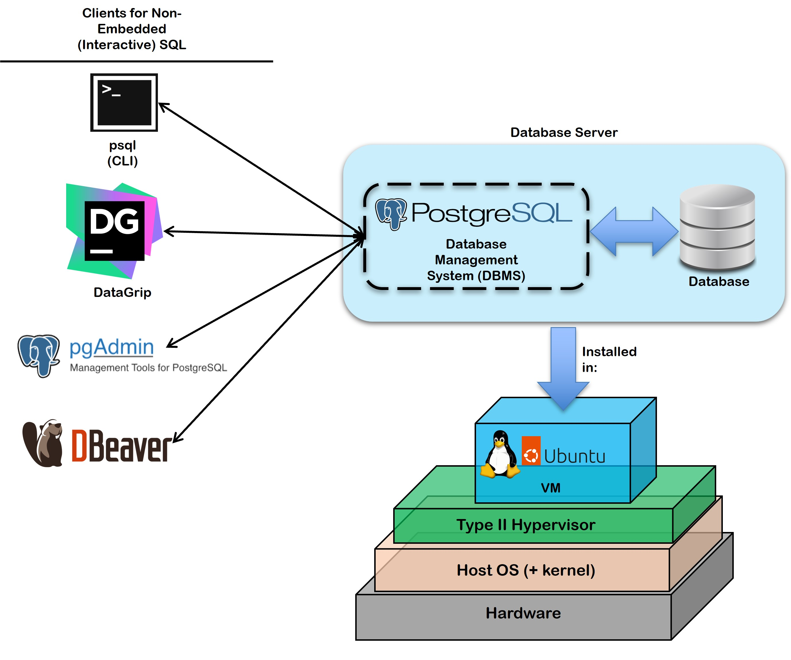
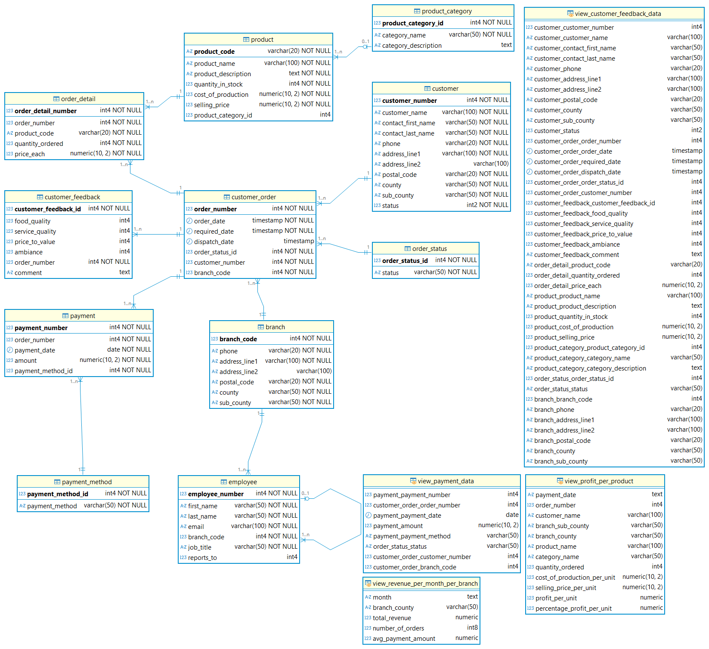

# Relational Algebra

| Key             | Value                                                                                                                                                                                                                                                                           |
|:----------------|:--------------------------------------------------------------------------------------------------------------------------------------------------------------------------------------------------------------------------------------------------------------------------------|
| **Course Code** | MCS 8104 and DAT 2201                                                                                                                                                                                                                                                                        |
| **Course Names** | MCS 8104: Database Management Systems<br>DAT 2201: Database Design and SQL                                                                                                                                                                                                                                    |
| **Semester**    | May to August 2026                                                                                                                                                                                                                                                              |
| **Lecturer**    | Allan Omondi                                                                                                                                                                                                                                                                    |
| **Contact**     | aomondi@strathmore.edu                                                                                                                                                                                                                                                          |
| **Note**        | The lecture contains both theory and practice.<br/>This notebook forms part of the practice.<br/>It is intended for educational purposes only.<br/>Recommended citation: [BibTex](https://raw.githubusercontent.com/course-files/RelationalAlgebra/refs/heads/main/RecommendedCitation.bib) |

## Technology Stack

<p align="left">


 


</p>

## System Architecture



## Entity-Relationship Diagram (ERD)



## Repository Structure

```text
.
├── 1_Install_PostgreSQL_in_Ubuntu_Server.md
├── 2_Relational_Algebra.md
├── LICENSE
├── README.md              → The file you are currently reading
├── RecommendedCitation.bib
├── assets
│   ├── ERD_of_siwaka_dishes.pgerd
│   ├── ERD_of_siwaka_dishes_From_DataGrip.drawio
│   └── images
│       ├── ERD_of_siwaka_dishes_From_DBeaver.png
│       ├── ERD_of_siwaka_dishes_From_DataGrip.png
│       ├── ERD_of_siwaka_dishes_From_PGAdmin.png
│       └── SystemArchitecture.jpg
└── data                    → Location of SQL scripts for creating the database
    └── 202605
        ├── 0_a_DDL_siwaka_dishes_original.sql
        ├── 1_a_DML_general_data.sql
        ├── 1_c_DML_employee_data.sql
        ├── 2_b_DML_customer_data.sql
        ├── 3_b_DML_customer_order_data.sql
        ├── 4_b_DML_order_detail_data.sql
        ├── 5_b_DML_payment_data.sql
        ├── 6_b_DML_customer_feedback_data.sql
        └── 7_a_DDL_other_DB_objects.sql

5 directories, 20 files
```

## Setup Instructions

- [Install PostgreSQL in Ubuntu Server](1_Install_PostgreSQL_in_Ubuntu_Server.md)

## Lab Manual

Refer to the file below for more details:

- [Relational Algebra](2_Relational_Algebra.md)

## Lab Submission Instructions

Refer to the end of the file below for more details:

- [Relational Algebra](2_Relational_Algebra.md)

## Cleanup Instructions (to be done after submitting the lab)

- You can delete the entire Virtual Machine instance that you created for this lab to free up resources on your laptop.

- However, if you wish to keep the instance for future use, you can simply stop it instead of deleting it. Stopping the instance will free up resources while allowing you to start it again whenever needed without having to go through the setup process again.

- For the sake of the semester-long project, you can stop it when you are not using it to save resources, and start it again when you need to work on the project.
